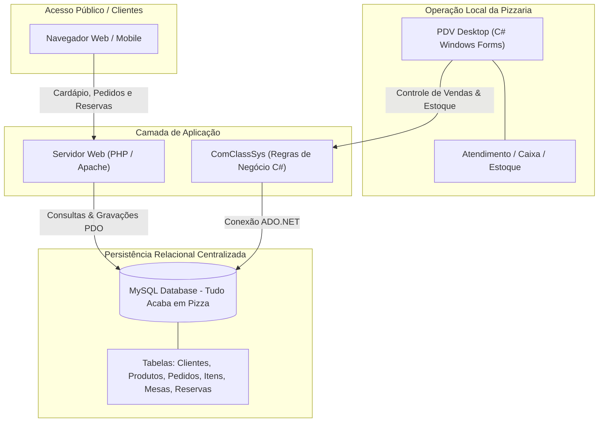

# 🍕 Tudo Acaba em Pizza — Sistema Integrado de Gestão de Pizzaria (PDV Desktop + Web + MySQL)

[](https://dotnet.microsoft.com/)
[](https://learn.microsoft.com/dotnet/desktop/winforms/)
[](https://www.php.net/)
[](https://www.mysql.com/)
[](https://www.sp.senac.br/)

> **Monorepo Consolidado**: Este repositório unifica os módulos da solução corporativa desenvolvida pela **Equipe NewTech** durante o curso de Tecnologia no **Senac**, preservando 100% do histórico original de commits, colaborações e créditos de todos os integrantes.

---

## 📌 Visão Geral da Solução

O **Tudo Acaba em Pizza** é um ecossistema completo para restaurantes e pizzarias, projetado para solucionar tanto a operação interna de atendimento quanto a captação de clientes pela internet. A solução é composta por:

1. **PDV & Retaguarda Desktop (C#)**: Utilizado por garçons, caixas e gerentes para abertura de comanda, controle de estoque de insumos, fechamento de caixa e emissão de pedidos.
2. **Portal Web do Cliente (PHP)**: Permite que clientes explorem o cardápio interativo, façam pedidos online e solicitem reservas de mesas com validação em tempo real.
3. **Banco de Dados Centralizado (MySQL)**: Base relacional normalizada compartilhada entre o Desktop e o Web, garantindo integridade de estoque e sincronização em tempo real de pedidos.



---

## 📁 Estrutura do Monorepo

```
tudo-acaba-em-pizza/
├── database/                 # Modelagem Relacional e Scripts SQL
│   ├── scripts/              # DDL (Criação de Tabelas), DML (Carga Inicial)
│   └── diagramas/            # Modelos Conceituais e Lógicos (Workbench .mwb)
│
├── desktop/                  # Sistema de Gestão Interna (C# Windows Forms)
│   ├── ComClassSys/          # Biblioteca de Classes e Regras de Negócio
│   │   ├── Banco.cs          # Conexão com banco de dados
│   │   ├── Cliente.cs        # Regras de cadastro de clientes
│   │   ├── Estoque.cs        # Controle e baixa de ingredientes
│   │   ├── Pedido.cs         # Orquestração de itens da comanda
│   │   └── Caixa.cs          # Abertura, fechamento e sangria
│   ├── ComercialSys/         # Interfaces Visuais (Formulários WinForms)
│   └── ComercialSys.sln      # Solução do Visual Studio
│
└── web/                      # Portal Web do Cliente (PHP / HTML5 / CSS3 / JS)
    ├── index.php             # Página inicial com destaques e carrossel
    ├── produtos_por_tipo.php # Cardápio categorizado (Pizzas doces, salgadas, bebidas)
    ├── produto_detalhes.php  # Detalhamento e personalização de ingredientes
    ├── anuncio_reserva.php   # Agendamento e validação de reservas de mesas
    └── assets/               # CSS, JavaScript e imagens promocionais
```

---

## 🚀 Principais Recursos

### 🖥️ Módulo Desktop (C#)
- **Abertura e Fechamento de Caixa**: Controle de operadores e conciliação de pagamentos (dinheiro, cartão, PIX).
- **Gestão de Comandas em Tempo Real**: Registro de pedidos por mesa com envio automático para a cozinha.
- **Controle Automatizado de Estoque**: Baixa automática de ingredientes e avisos visuais de estoque crítico.
- **Arquitetura em Camadas**: Separação clara entre a interface de usuário (Windows Forms) e a camada de acesso a dados (`ComClassSys`).

### 🌐 Módulo Web (PHP)
- **Cardápio Interativo**: Busca rápida e filtros por categoria de produtos.
- **Sistema de Reservas Inteligente**: Regras de antecedência mínima (24h), limite diário por CPF e geração de código de reserva para confirmação por e-mail.
- **Segurança de Dados**: Prepared Statements para prevenção contra ataques de SQL Injection e validação de entradas.

---

## 💻 Instruções de Instalação e Execução

### 1. Banco de Dados (MySQL)
1. Instale o MySQL 8.0+ ou MySQL Server via XAMPP/WampServer.
2. Crie a base de dados:
   ```sql
   CREATE DATABASE tudo_acaba_em_pizza CHARACTER SET utf8mb4 COLLATE utf8mb4_unicode_ci;
   ```
3. Importe os scripts localizados em `database/` para criar as tabelas e dados iniciais.

### 2. Módulo Desktop (C#)
1. Abra a solução `desktop/ComercialSys.sln` no [Visual Studio](https://visualstudio.microsoft.com/).
2. Atualize a string de conexão em `ComClassSys/Banco.cs` com as credenciais do seu MySQL local.
3. Compile e execute a aplicação (`F5`).

### 3. Módulo Web (PHP)
1. Copie a pasta `web/` para o diretório de publicação do servidor (`htdocs` no XAMPP ou `/var/www/html` no Apache).
2. Configure o arquivo de conexão PDO com os dados do MySQL.
3. Acesse `http://localhost/web/index.php` no navegador.

---

## 👥 Equipe NewTech (Senac)

Este projeto foi construído colaborativamente pelo time de desenvolvimento:

- [**Antonio Carlos da Silva Alves**](https://github.com/ANTONIO33c)
- [**Bruno Eduardo Freires da Silva**](https://github.com/BrunoFreires)
- [**Matheus Silva Berloffe**](https://github.com/berloffe)
- [**Wendell de Souza Dorta**](https://github.com/WendellD3v)

---

## 🔗 Referências Originais e Repositório Principal

- **Repositórios da Organização Original do Projeto**: [NewTechEmp (Repositórios)](https://github.com/orgs/NewTechEmp/repositories)
- **Repositório Monorepo no GitHub**: [Wendell-Dorta/Tudo-Acaba-em-Pizza](https://github.com/Wendell-Dorta/Tudo-Acaba-em-Pizza)
- **Status e Evolução**: Este monorepo mantém o registro completo do histórico de commits e colaboração da equipe NewTech, servindo como base consolidada para evolução técnica, modernização para .NET Core e demonstração de portfólio por **Wendell Dorta**.
